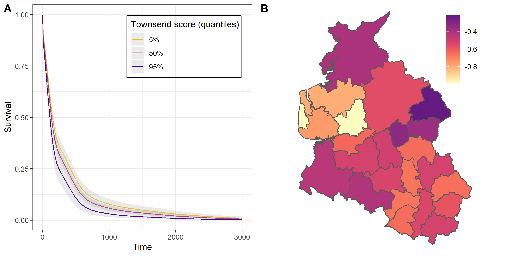
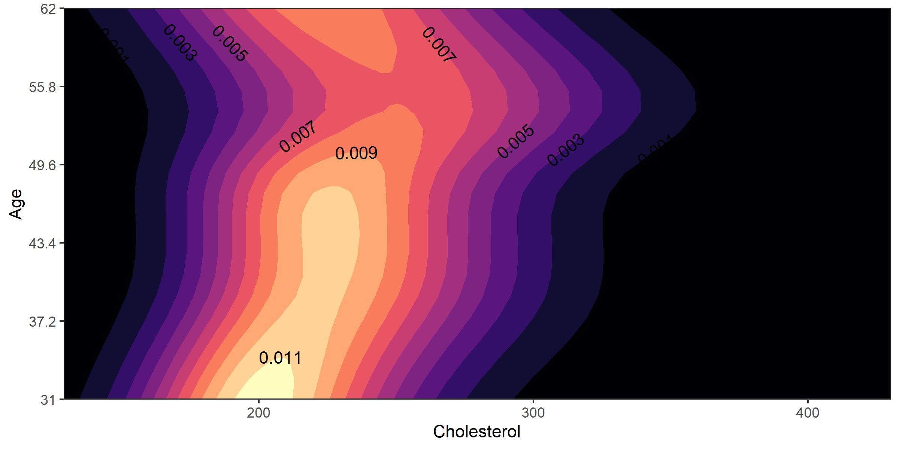
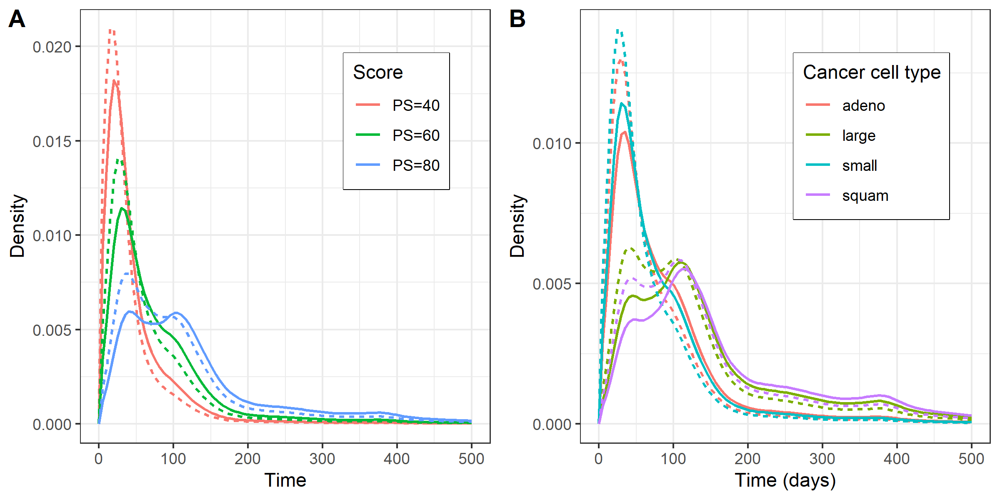

# Some things Bayesian Conditional Transformation Models (BCTMs) can do (as shown in our [paper](https://www.tandfonline.com/doi/abs/10.1080/01621459.2023.2191820))
BCTMs are able to flexibly estimate the whole conditional distribution of the responses, i.e. a respone distribution does not have to be specified beforehand. The covariates impact (possibly) the whole conditional response distribution in form of linear, nonlinear, random or spatial effects on the scale of the transformation function. BCTMs perform posterior estimation on basis of the NUTS Sampler with mutlivariate Gaussian priors for the basis coefficients and with  gamma priors for the smoothing variances.

##  [Leukemia Survival](leukemia)
**Proportional Hazards with Spatial Frailties**

Based on a dataset on acute myeloid leukemia survival ([[1]](#1)).

* analyzing impact of prognostic factors *age*, *sex*, *white blood cell count*  and *Townsend score*(indicating less affluent residential areas for higher values), 
* investigating spatial patterns for 24 administrative regions in North West England; . * reference is the minimum extreme value distribution resulting in a proportional hazards model

---

##  [Framingham Heart Study](framingham)
**Modelling Conditional Distribution of Cholesterol Levels for Heart Patients**

Based on a Framingham Heart Study ([[2]](#2)).

---

##  [Lung Cancer Survival](veteran)
**Semiparametric (Non-)Proportional Odds with Censoring**

Based on a Veteran’s Administration lung cancer trial dataset ([[3]](#3)).

* analyzing odds of survival dependent on Karnofsky Performance Score and different lung cancer types
* partial right-censoring

---

## References

<a id="1">[1]</a>
Henderson, R., Shimakura, S. and Gorst, D. (2002).
Modeling spatial variation in leukemia survival data.
Biometrics 57(3): 795-802

<a id="2">[2]</a>
Zhang, D. and Davidian, M. (2001).
Linear mixed models with flexible distributions of random effects for
longitudinal data.
Biometrika 60(2): 279-288.

<a id="3">[3]</a>
Prentice, R. L. (1973).
Exponential survivals with censoring and explanatory variables.
Journal of the American Statistical Association 97(460): 965-972.
